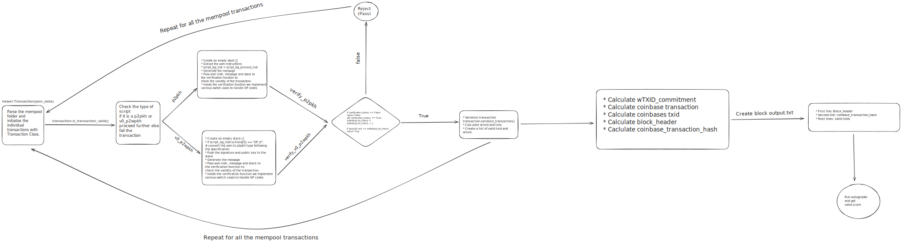

# BlockForge

A high-performance block construction engine that validates transactions and mines blocks from first principles.

## Overview

BlockForge is a Bitcoin-inspired blockchain simulation project that focuses on transaction validation and block mining. This project demonstrates the core concepts of blockchain technology without relying on existing Bitcoin libraries.

## Features

- Handles two types of transactions: p2pkh and v0_p2wpkh
- Implements transaction validation and block construction
- Achieves a score of 62/100 in performance benchmarks
- Completes processing in under 3 minutes

## Implementation Details

The project follows a systematic approach to transaction processing and block construction:

1. Parses transaction data from the mempool
2. Validates transactions based on their type (p2pkh or v0_p2wpkh)
3. Constructs valid blocks from verified transactions
4. Calculates necessary block components (WTXID, coinbase transaction, block header, etc.)
5. Outputs the final block data

For a detailed view of the process, refer to the workflow diagram above.

## Performance

- Score: 62/100
- Processing time: < 3 minutes

## Future Improvements

- Implement handling for additional transaction types
- Optimize for higher performance scores
- Incorporate more comprehensive validation checks

## Resources

This project was developed with reference to:
- [Learn Me A Bitcoin](https://learnmeabitcoin.com/)
- [Bitcoin SV Wiki](https://wiki.bitcoinsv.io/)
- [Bitcoin Wiki](https://en.bitcoin.it/)

## Usage

- Clone the repo
- Use devenv to setup the nix environment
- Run `./run.sh`

